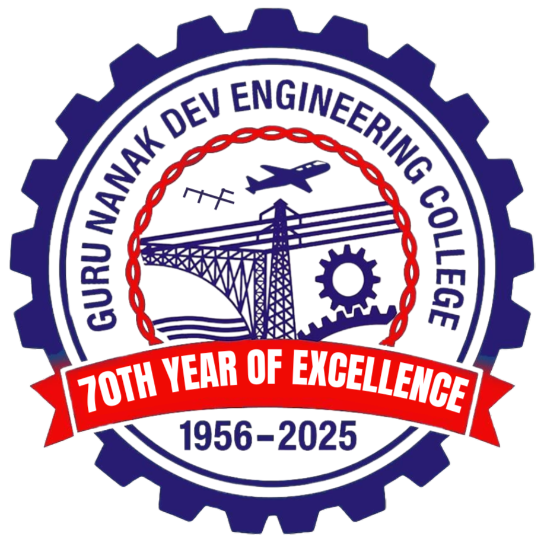

<h1 align="center">GNDEC Times</h1>

<b>Annual Newsletter 2025</b>

<a href="./"><b>Home</b></a> &nbsp;&nbsp;•&nbsp;&nbsp;
<a href="Content/CoverPage/Contents"><b>Contents</b></a> &nbsp;&nbsp;•&nbsp;&nbsp;
<a href="Content/EditorialBoard/EditorialBoard"><b>Editorial Board</b></a> &nbsp;&nbsp;•&nbsp;&nbsp;
<a href="https://gndec.ac.in/"><b>GNDEC Website</b></a> &nbsp;&nbsp;•&nbsp;&nbsp;
<a href="Content/CoverPage/Contact"><b>Contact</b></a>

━━━━━━━━━━━━━━━━━━━━━━━━━━━━━━━━━━━━━━━━

<b>GNDEC Times</b> documents the academic achievements,
innovations, and vibrant campus life of <b>Guru Nanak Dev Engineering College, Ludhiana</b>.

This volume highlights major developments during the academic year,
including research initiatives, student accomplishments,
technical events, institutional milestones,
and contributions from faculty and alumni.

━━━━━━━━━━━━━━━━━━━━━━━━━━━━━━━━━━━━━━━━

<b>Documenting Excellence • Innovation • Service</b>

© 2025 Guru Nanak Dev Engineering College, Ludhiana

